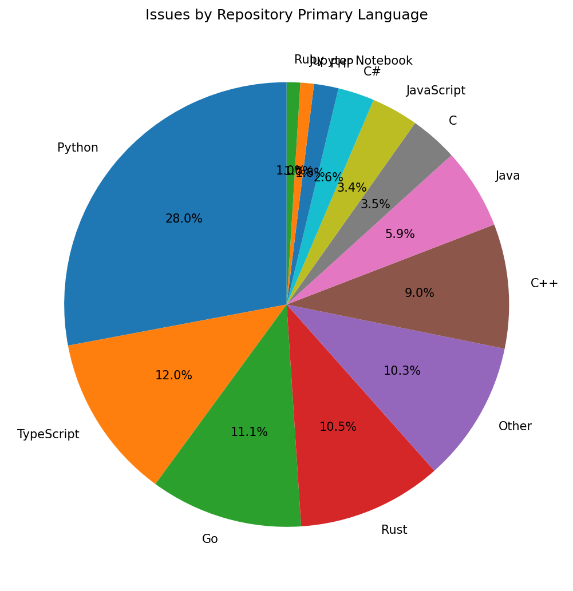
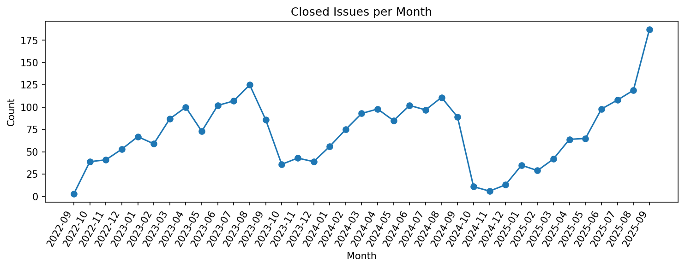
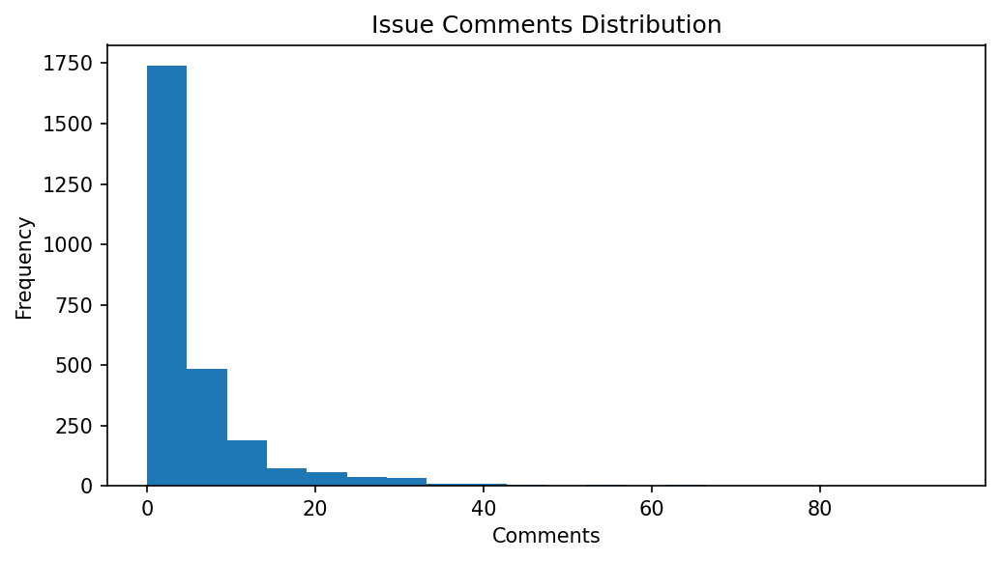
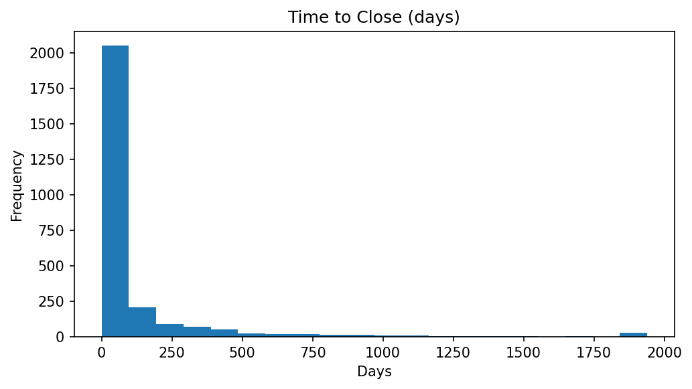
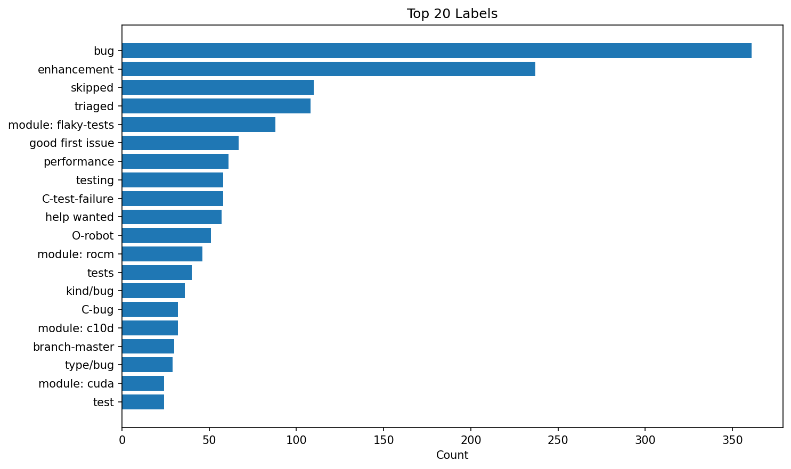
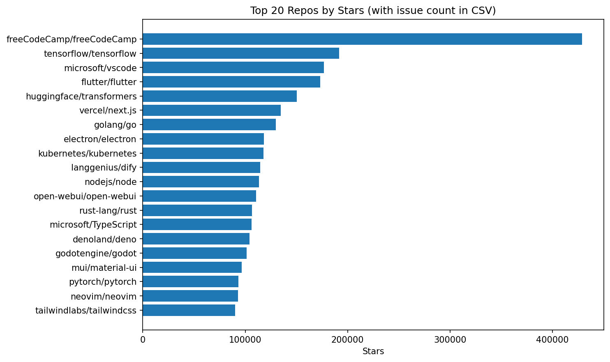

# Slow Test Analysis Summary

- Total issues: **2643**
- Unique repositories: **1722**
- Top languages: {'Python': 739, 'TypeScript': 317, 'Go': 293, 'Rust': 278, 'C++': 239}
- CSV summaries: `languages.csv`, `labels.csv`, `owners.csv`, `repos.csv`, `summary_stats.csv`

